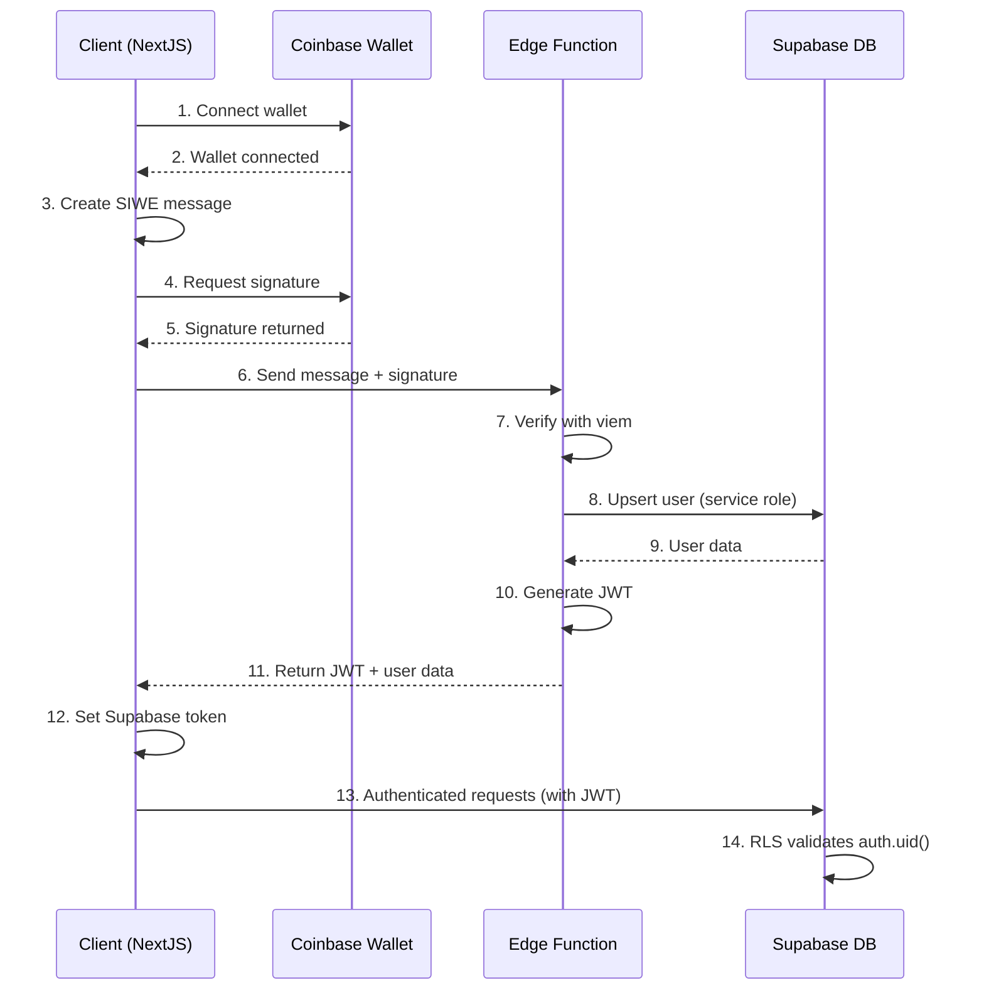

# Pagent Money Authentication Architecture

## 概述 (Overview)

This document outlines the refactored authentication architecture for Pagent Money, following best practices for SIWE (Sign-In with Ethereum) authentication with Coinbase Smart Wallets and Supabase.

## 架构组件 (Architecture Components)

### 1. Client Side (Mini App + OnchainKit)

**Components:**
- `src/app/providers.tsx` - Main provider wrapper with OnchainKit and SiweAuthProvider
- `src/hooks/useSiweAuth.tsx` - Primary authentication hook
- `src/components/PageHeader.tsx` - Wallet connection UI using OnchainKit

**Flow:**
1. User connects wallet through OnchainKit components
2. App requests SIWE signature from connected wallet (EOA or Smart Wallet)
3. OnchainKit provides wallet components and signing helpers
4. SIWE message created with proper domain, nonce, and timestamp validation

**Key Features:**
- Supports both EOA and Smart Wallet authentication
- Automatic chain validation (Base Mainnet/Sepolia)
- Proper error handling and user feedback
- Session persistence and recovery

### 2. Edge Function (Supabase)

**Location:** `supabase/functions/siwe-auth/index.ts`

**Verification Process:**
- ✅ Uses `viem.verifyMessage` for comprehensive signature verification
- ✅ Supports EOAs, EIP-1271 smart wallets, and ERC-6492 pre-deployment signatures
- ✅ Domain, nonce, and timestamp validation
- ✅ Fallback verification methods for edge cases

**Improvements Made:**
- Upgraded from ethers.js to viem for better smart wallet support
- Enhanced EIP-1271 verification for Coinbase Smart Wallets
- Comprehensive error logging and debugging
- Proper JWT minting with Supabase-compatible structure

**JWT Structure:**
```json
{
  "sub": "user_uuid",
  "wallet_address": "0x...",
  "user_id": "user_uuid", 
  "aud": "authenticated",
  "role": "authenticated",
  "iat": 1640995200,
  "exp": 1640998800,
  "iss": "pagent-siwe-auth",
  "app_metadata": {
    "provider": "siwe",
    "wallet_type": "coinbase_smart_wallet",
    "chain_id": 8453
  },
  "user_metadata": {
    "wallet_address": "0x...",
    "is_new_user": false,
    "chain_id": 8453
  }
}
```

### 3. Supabase (Database + RLS)

**RLS Policies:** `supabase/migrations/20241215000001_add_rls_policies.sql`

**Security Features:**
- ✅ All user-related tables protected with RLS using `auth.uid()`
- ✅ Policies ensure users can only access their own data
- ✅ Service role bypass for backend operations
- ✅ Helper functions for address ownership validation

**Protected Tables:**
- `users` - User profiles and smart account mapping
- `permissions` - Spend permission management
- `receipts` - Transaction receipts
- `credit_usage` - Credit usage tracking
- `spend_permissions` - Permission details
- `credit_transactions` - Transaction history

**Authentication Flow:**
1. SIWE verification in Edge Function
2. JWT minted with user UUID as `sub`
3. JWT sent to client and stored
4. Client uses JWT for all Supabase requests
5. RLS policies enforce data access based on `auth.uid()`

## 认证流程 (Authentication Flow)



## 密钥管理 (Key Management)

### Environment Variables
```bash
# Supabase Configuration
SUPABASE_URL=https://your-project.supabase.co
SUPABASE_SERVICE_ROLE_KEY=your_service_role_key
JWT_SECRET=your_jwt_signing_secret

# Client Configuration  
NEXT_PUBLIC_SUPABASE_URL=https://your-project.supabase.co
NEXT_PUBLIC_SUPABASE_ANON_KEY=your_anon_key
NEXT_PUBLIC_COINBASE_API_KEY=your_coinbase_api_key
```

### Security Best Practices
- ✅ Service role key never exposed to frontend
- ✅ JWT signing secret kept secure in edge function environment
- ✅ Rate limiting on authentication endpoints
- ✅ CORS properly configured for browser requests
- ✅ Session expiration and refresh handling

## 主要改进 (Key Improvements)

### 1. Signature Verification
- **Before:** ethers.js with limited smart wallet support
- **After:** viem with comprehensive EIP-1271 and ERC-6492 support

### 2. Database Security
- **Before:** No RLS policies, potential data leakage
- **After:** Comprehensive RLS with auth.uid() validation

### 3. Authentication Provider
- **Before:** Multiple conflicting auth providers
- **After:** Single SIWE-based authentication system

### 4. JWT Integration
- **Before:** Custom token without Supabase integration
- **After:** Supabase-compatible JWT with proper RLS integration

## 使用示例 (Usage Examples)

### Client Authentication
```typescript
import { useAuth } from '@/hooks/useSiweAuth'

function MyComponent() {
  const { isAuthenticated, user, authenticate, logout } = useAuth()
  
  if (!isAuthenticated) {
    return <button onClick={authenticate}>Connect Wallet</button>
  }
  
  return (
    <div>
      <p>Welcome {user?.address}</p>
      <button onClick={logout}>Disconnect</button>
    </div>
  )
}
```

### Database Queries (Automatic RLS)
```typescript
import { getAuthenticatedClient } from '@/lib/supabase-auth'

// This automatically uses the JWT token and applies RLS
const supabase = getAuthenticatedClient()
const { data } = await supabase
  .from('receipts')
  .select('*') // Only returns current user's receipts
```

## 安全考虑 (Security Considerations)

1. **Signature Replay Prevention:** Nonce and timestamp validation
2. **Domain Validation:** Ensures SIWE messages are for correct domain
3. **Chain Validation:** Only accepts Base Mainnet (8453) and Sepolia (84532)
4. **RLS Enforcement:** Database-level security for all user data
5. **Token Expiration:** JWT tokens expire after 1 hour
6. **Service Role Protection:** Backend operations use service role, not exposed to client

## 测试和部署 (Testing and Deployment)

### Local Development
```bash
# Start Supabase local development
supabase start

# Apply migrations
supabase db push

# Test authentication
npm run dev
```

### Production Deployment
1. Deploy Supabase migrations
2. Configure environment variables
3. Deploy edge functions
4. Test wallet connection and authentication flow

## 故障排除 (Troubleshooting)

### Common Issues
1. **Signature Verification Fails:** Check chain ID and wallet type
2. **RLS Denies Access:** Verify JWT token is properly set
3. **Smart Wallet Issues:** Ensure EIP-1271 support is working
4. **CORS Errors:** Check edge function CORS configuration

### Debug Mode
Set `SKIP_SIGNATURE_VERIFICATION=true` in edge function environment for testing (NEVER in production).

## 未来改进 (Future Improvements)

1. **Multi-chain Support:** Extend beyond Base to other chains
2. **Session Refresh:** Automatic JWT token refresh
3. **Biometric Authentication:** Add device-based authentication
4. **Analytics:** Track authentication success rates and failure modes
