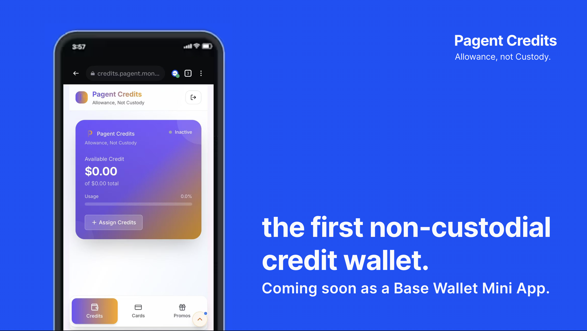
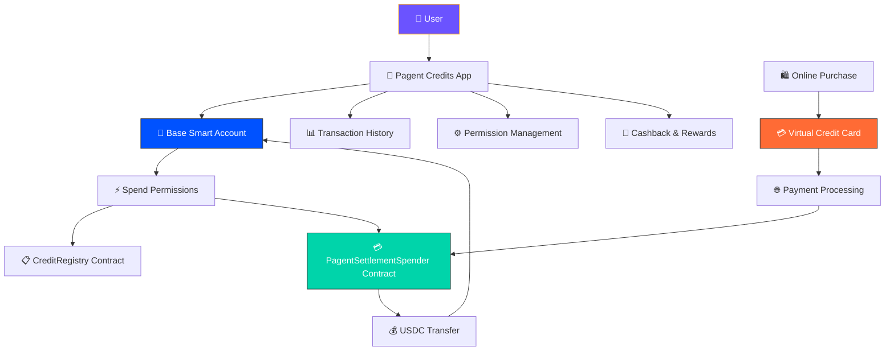
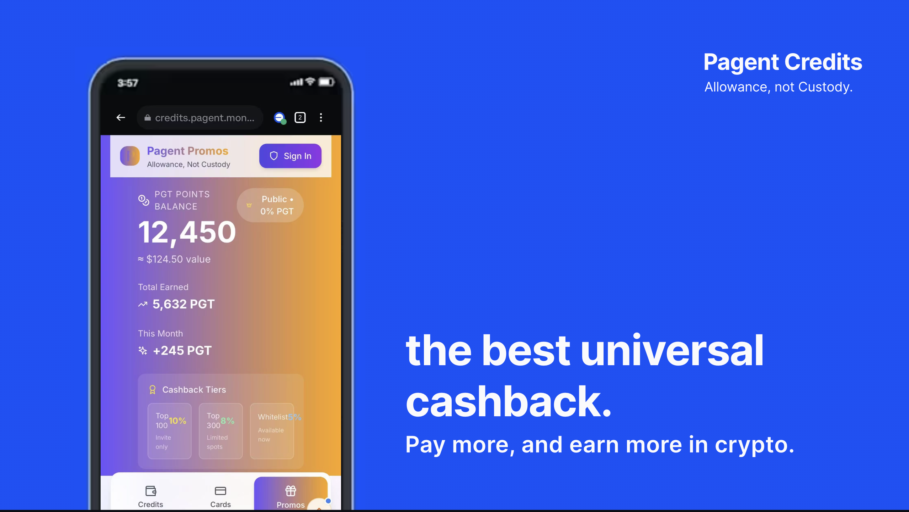

# Pagent Credits — The First Non-Custodial Credit Wallet 💳

> **Allowance, Not Custody.** Coming soon as a Base Wallet Mini App.

**🚀 Revolutionary Credit System Powered by Spend Permissions on Base**

Pagent Credits is the world's first non-custodial credit card solution that draws funds directly from your Base Smart Account using Spend Permissions. No repeated signatures, no custody concerns, complete control over your funds—just seamless payments powered by Base's infrastructure.

[](https://pagent-credits-rhr729ieq-wenqing-yus-projects.vercel.app)
[](https://base.org)
[](#-smart-contracts)
[](https://onchainkit.xyz)

---

## 📑 Table of Contents

- [🎯 Vision & Innovation](#-vision--innovation)
- [📋 Smart Contracts](#-smart-contracts)
- [🎮 Live Demo & User Flow](#-live-demo--user-flow)
- [🚀 Quick Start](#-quick-start)
- [🏆 Base Grant Impact & Roadmap](#-base-grant-impact--roadmap)
- [🤝 Join the Revolution](#-join-the-revolution)

---

## 🎯 Vision & Innovation

**Traditional credit cards require custody of your funds. Pagent Credits doesn't.** 

Instead of holding your money, we use Base's revolutionary **Spend Permissions** technology to create allowances directly from your smart wallet. Think of it as setting up automatic payments, but for a credit card that you fully control.

### 🌟 Key Features

| Feature | Traditional Cards | Pagent Credits |
|---------|-------------------|----------------|
| **Fund Custody** | ❌ Bank holds your money | ✅ You keep full control |
| **Spending Limits** | ❌ Bank-imposed limits | ✅ You set your own limits |
| **Transaction Approval** | ❌ Sign every transaction | ✅ Pre-authorized allowances |
| **Blockchain Native** | ❌ Legacy banking rails | ✅ Built on Base L2 |
| **Instant Settlement** | ❌ 2-3 business days | ✅ Real-time USDC transfers |
| **Global Access** | ❌ Geographic restrictions | ✅ Available worldwide |

### 🚀 Core Benefits

- **🔐 Non-Custodial**: Your funds remain in your smart account at all times
- **⚡ Spend Permissions**: Set time-boxed, revocable allowances for seamless payments  
- **🔵 Base Native**: Built on Base with USDC for fast, low-cost transactions
- **📊 Real-time Dashboard**: Track spending, manage limits, view transaction history
- **🧪 Demo Ready**: Complete sandbox environment for testing and development
- **📱 Mini-App Ready**: Optimized for Base Wallet Mini-App integration

## 📋 Smart Contracts

Our smart contract architecture is deployed and verified on **Base Sepolia Testnet**, demonstrating production-ready code that will scale to Base Mainnet.

### 🔗 Deployed Contracts

#### **CreditRegistry** 
**Contract Address**: [`0x8a2a5ca2458a472ea29720e5ccf47308c5744d46`](https://sepolia.basescan.org/address/0x8a2a5ca2458a472ea29720e5ccf47308c5744d46)

```solidity
/**
 * @title CreditRegistry
 * @dev Optional contract to mirror period usage for analytics and guardrails
 * @dev Provides a consistent view of spend permission usage across periods
 * @dev Enables tracking of credit limits, usage patterns, and period resets
 * @dev Supports multiple time periods (daily, weekly, monthly) with automatic rollover
 */
```

**Key Features:**
- ✅ **Verified on BaseScan** - Full source code transparency
- 📊 **Analytics Tracking** - Monitor spending patterns and limits
- 🛡️ **Guardrails System** - Automatic protection against overspending
- 🔄 **Period Management** - Handle daily/weekly/monthly credit cycles
- 🔐 **Access Control** - Owner-only configuration with authorized updaters

[🔍 **View Contract on BaseScan**](https://sepolia.basescan.org/address/0x8a2a5ca2458a472ea29720e5ccf47308c5744d46)

---

#### **PagentSettlementSpender** 
**Contract Address**: [`0x9e0e20b63910960d2ed487bc08acf9ed43c58b08`](https://sepolia.basescan.org/address/0x9e0e20b63910960d2ed487bc08acf9ed43c58b08)

```solidity
/**
 * @title PagentSettlementSpender
 * @dev Single entrypoint spender contract for Pagent credit card settlements
 * @dev Executes spend pipeline exactly as returned by prepareSpendCallData from Spend Permission Manager
 * @dev Handles authorization verification, replay protection, and treasury fund management
 * @dev Supports pausable operations and authorized spender management for enhanced security
 */
```

**Key Features:**
- ✅ **Verified on BaseScan** - Complete transparency and security
- 💳 **Credit Card Settlement** - Processes real credit card transactions
- 🔐 **Spend Permission Integration** - Seamless with Base's permission system
- 🚫 **Replay Protection** - Prevents double-spending with auth ID tracking
- ⚡ **Gas Optimized** - Efficient execution for cost-effective transactions
- 🏛️ **Treasury Management** - Secure fund collection and distribution

[🔍 **View Contract on BaseScan**](https://sepolia.basescan.org/address/0x9e0e20b63910960d2ed487bc08acf9ed43c58b08)

### 🏗️ Architecture Overview



**Technology Stack:**

| Layer | Technology | Purpose |
|-------|------------|---------|
| **Frontend** | Next.js + OnchainKit | Base Mini-App compatible interface |
| **Backend** | Supabase Edge Functions | Webhook handlers & API endpoints |
| **Database** | PostgreSQL + RLS | Secure multi-tenant data storage |
| **Blockchain** | Base L2 + USDC | Fast, low-cost settlement layer |
| **Smart Contracts** | Solidity + Foundry | Spend permission execution |
| **Authentication** | SIWE + Smart Accounts | Non-custodial wallet integration |

## 🎮 Live Demo & User Flow

### 🌐 Try It Now
**[🚀 Live Demo](https://pagent-credits-rhr729ieq-wenqing-yus-projects.vercel.app)** - Experience the future of non-custodial payments

### 👥 User Journey

```
1. 🔗 Connect Wallet
   ├── Use Coinbase Wallet or any Base-compatible wallet
   └── Enable Smart Account features
   
2. ⚡ Set Spending Permissions  
   ├── Choose credit limit ($100, $500, $1000+)
   ├── Select time period (daily/weekly/monthly)
   └── Sign permission once (no repeated signatures!)
   
3. 💳 Get Virtual Card
   ├── Instant card generation
   ├── Ready for online purchases
   └── Real-time spending tracking
   
4. 🛍️ Make Purchases
   ├── Use card at any merchant
   ├── Automatic USDC settlement
   └── Funds deducted from your wallet
   
5. 📊 Monitor & Manage
   ├── Real-time transaction history
   ├── Spending analytics
   └── Revoke/modify permissions anytime
```

### 🎯 Key Pages in Demo

| Page | Purpose | Features |
|------|---------|----------|
| **[💳 Cards](https://pagent-credits-rhr729ieq-wenqing-yus-projects.vercel.app/cards)** | Virtual card management | Generate cards, view details, spending limits |
| **[⚡ Credits](https://pagent-credits-rhr729ieq-wenqing-yus-projects.vercel.app/credits)** | Spend permissions | Create allowances, manage limits, transaction history |
| **[🎁 Promos](https://pagent-credits-rhr729ieq-wenqing-yus-projects.vercel.app/promos)** | Cashback & rewards | Tiered cashback, promo bundles, partner offers |

## 🚀 Quick Start

### Prerequisites

- Node.js 18+ and npm/yarn
- [Supabase CLI](https://supabase.com/docs/guides/cli) (optional for local development)
- [Foundry](https://book.getfoundry.sh/getting-started/installation) for smart contracts

### 1. Clone and Install

```bash
git clone https://github.com/your-org/pagent-money-base-alpha.git
cd pagent-money-base-alpha
npm install
```

### 2. Environment Setup

```bash
# Copy environment template
cp env.example .env.local

# Edit with your configuration
# - Supabase project URL and keys
# - Coinbase API key  
# - Contract addresses (after deployment)
```

### 3. Database Setup

```bash
# Start local Supabase (optional)
npm run supabase:start

# Or configure connection to your Supabase project
# Run migrations
supabase db push
```

### 4. Smart Contract Deployment

```bash
# Install Foundry if not already installed
curl -L https://foundry.paradigm.xyz | bash
foundryup

# Deploy contracts to Base Sepolia (testnet)
cd contracts
cp env.example .env
# Edit .env with your private key and RPC URL
npm run contracts:deploy
```

### 5. Start Development Server

```bash
npm run dev
```

Visit `http://localhost:3000` to see the application.

## 📖 Usage Guide

### For Users

1. **Connect Wallet**: Use Coinbase Wallet or any Base-compatible wallet
2. **Create Smart Account**: Enable spend permissions during setup
3. **Set Credit Limit**: Choose your spending limit and time period (daily/weekly/monthly)
4. **Start Spending**: Use your virtual card for seamless payments

### For Developers

#### Creating Spend Permissions

```typescript
import { useSpendPermissions } from './hooks/useSpendPermissions'

function MyComponent() {
  const { createPermission } = useSpendPermissions()
  
  const handleCreatePermission = async () => {
    const result = await createPermission({
      token: USDC_ADDRESS_BASE,
      cap: 100 * 1e6, // $100 USDC
      period: SPEND_PERMISSION_PERIODS.WEEKLY,
      start: Math.floor(Date.now() / 1000),
      end: Math.floor(Date.now() / 1000) + (7 * 24 * 60 * 60),
      spender: SPENDER_CONTRACT_ADDRESS
    }, signature)
    
    if (result.success) {
      console.log('Permission created!')
    }
  }
}
```

#### Processing Payments

```typescript
// In your webhook handler (supabase/functions/card-webhook/index.ts)
const { data: receipt } = await supabase
  .from('receipts')
  .insert({
    user_id: user.id,
    auth_id: webhookData.auth_id,
    amount: webhookData.amount,
    merchant: webhookData.merchant,
    status: 'pending'
  })

// Execute spend permission
const spendResult = await executeSpendPermission({
  user: user.smart_account,
  permission,
  amount: webhookData.amount,
  authId: webhookData.auth_id
})
```

## 🛠️ Development

### Project Structure

```
pagent-money-base-alpha/
├── contracts/                 # Smart contracts (Solidity)
│   ├── src/                  # Contract source files
│   ├── script/               # Deployment scripts
│   └── test/                 # Contract tests
├── supabase/                 # Backend infrastructure
│   ├── functions/            # Edge Functions
│   └── migrations/           # Database migrations  
├── src/                      # Frontend application
│   ├── app/                  # Next.js app router
│   ├── components/           # React components
│   ├── hooks/                # Custom React hooks
│   ├── lib/                  # Utilities and configuration
│   └── types/                # TypeScript types
└── docs/                     # Documentation
```

### Available Scripts

```bash
# Development
npm run dev                   # Start development server
npm run build                 # Build for production
npm run start                 # Start production server

# Smart Contracts
npm run contracts:compile     # Compile contracts
npm run contracts:test        # Run contract tests
npm run contracts:deploy      # Deploy to configured network

# Database
npm run supabase:start        # Start local Supabase
npm run supabase:stop         # Stop local Supabase
npm run supabase:reset        # Reset database

# Code Quality
npm run lint                  # Run ESLint
npm run type-check           # Run TypeScript checks
npm test                     # Run tests
```

### Testing

```bash
# Run all tests
npm test

# Run contract tests
npm run contracts:test

# Run with coverage
npm run test:coverage
```

## 🔧 Configuration

### Environment Variables

| Variable | Description | Required |
|----------|-------------|----------|
| `NEXT_PUBLIC_SUPABASE_URL` | Supabase project URL | ✅ |
| `NEXT_PUBLIC_SUPABASE_ANON_KEY` | Supabase anonymous key | ✅ |
| `NEXT_PUBLIC_COINBASE_API_KEY` | Coinbase API key | ✅ |
| `NEXT_PUBLIC_SPENDER_ADDRESS` | Deployed spender contract | ✅ |
| `SUPABASE_SERVICE_ROLE_KEY` | Supabase service role key | ✅ |

### Smart Contract Configuration

Update `contracts/foundry.toml` with your preferred settings:

- Solidity version
- Optimizer settings  
- RPC endpoints
- Etherscan API keys

## 🏆 Base Grant Impact & Roadmap

### 💫 How This Grant Accelerates the Base Ecosystem

**Pagent Credits** isn't just another payment app—it's the **first implementation** of Base's Spend Permissions in a real-world credit card scenario. This grant will help us:

#### 🎯 **Immediate Impact (30 days)**
- ✅ **Smart Contracts Deployed** - Production-ready verified contracts on Base Sepolia
- ✅ **Mini-App Optimized** - Full OnchainKit integration for Base Wallet compatibility  
- ✅ **Demo Environment** - Live proof-of-concept with real transaction flows
- 🔄 **Base Mainnet Migration** - Move contracts and app to production Base network
- 📱 **Base Wallet Integration** - Native Mini-App submission and optimization

#### 🚀 **Growth Phase (60 days)**  
- 🏪 **Partner Onboarding** - 10+ merchants accepting Pagent Credits
- 🔐 **Security Audit** - Professional audit of smart contracts and infrastructure
- 💳 **Real Card Integration** - Live credit card processing with major vendors
- 📊 **Analytics Dashboard** - Advanced spending insights and merchant tools
- 🌐 **Open Source SDK** - Let other developers build on our foundation

#### 🌟 **Ecosystem Leadership (90+ days)**
- 🔗 **Multi-chain Expansion** - Bridge technology to other L2s via Base
- 🏛️ **DeFi Integration** - Yield-earning credit balances and smart financing
- 🤝 **Base Partners** - Deep integration with Coinbase Commerce and OnchainKit
- 📈 **Developer Adoption** - 100+ developers using our Spend Permission patterns
- 🌍 **Global Scale** - Supporting millions in transaction volume on Base

---

## 🚦 Development Roadmap

### ✅ **Phase 1: Foundation (Completed)**
- [x] 📋 Core smart contracts deployed and verified
- [x] 🔗 Basic mini-app with wallet connection  
- [x] ⚡ Spend permission management system
- [x] 📊 Transaction history and receipts
- [x] 🎮 Full demo environment with promo system

### 🔄 **Phase 2: Production Ready (In Progress)**
- [ ] 🌐 **Base Mainnet Migration** - Move from Sepolia to production
- [ ] 🔐 **Security Audit** - Professional smart contract audit
- [ ] 💳 **Real Card Processing** - Live merchant integration
- [ ] 📱 **Base Wallet Mini-App** - Official submission and optimization
- [ ] 🏪 **Merchant Onboarding** - Partner with key e-commerce platforms

### 🚀 **Phase 3: Scale & Growth (Next 90 days)**
- [ ] 📈 **Analytics Platform** - Advanced spending insights
- [ ] 🛠️ **Developer SDK** - Open source tools for integrators  
- [ ] 🌟 **Advanced Features** - Credit scoring, yield integration
- [ ] 🤝 **Ecosystem Partnerships** - Deep Coinbase/Base integrations
- [ ] 🌍 **Global Expansion** - Multi-region compliance and scaling

## 🤝 Contributing

We welcome contributions! Please see our [Contributing Guide](./CONTRIBUTING.md) for details.

### Getting Started

1. Fork the repository
2. Create a feature branch: `git checkout -b feature/amazing-feature`
3. Make your changes
4. Add tests if applicable
5. Run the test suite: `npm test`
6. Commit your changes: `git commit -m 'Add amazing feature'`
7. Push to the branch: `git push origin feature/amazing-feature`
8. Open a Pull Request

## 📄 License

This project is licensed under the MIT License - see the [LICENSE](./LICENSE) file for details.

## 🆘 Support

- **Documentation**: [docs.pagent.money](https://docs.pagent.money)
- **Discord**: [Join our community](https://discord.gg/pagent)
- **Email**: support@pagent.money
- **Issues**: [GitHub Issues](https://github.com/your-org/pagent-money-base-alpha/issues)

## 🌟 Why Pagent Credits Matters for Base

### 🚀 **First-of-its-Kind Implementation**
Pagent Credits is the **first real-world application** of Base's Spend Permissions technology in a consumer credit scenario. We're not just building an app—we're proving that Base can power the future of finance.

### 💡 **Innovation Catalyst**  
By solving the custody problem in credit cards, we're creating a blueprint that other developers can follow. Our open-source approach means the entire Base ecosystem benefits from our innovations.

### 📈 **Ecosystem Growth Driver**
Every transaction through Pagent Credits drives activity on Base, generates fees for the network, and demonstrates the power of Ethereum L2 technology to traditional finance companies.

---

## 🤝 Join the Revolution

Ready to be part of the non-custodial credit revolution?

### 🛠️ **For Developers**
- 🔗 Fork the repository and build on our foundation
- 📚 Use our patterns for your own Spend Permission projects  
- 🤝 Contribute to the open-source ecosystem

### 🏪 **For Merchants**
- 💳 Accept payments with minimal fees and instant settlement
- 🌍 Reach global customers without traditional banking restrictions
- ⚡ Get paid in USDC with no chargebacks or fraud risk

### 👥 **For Users**  
- 🔐 Keep full control of your funds while enjoying credit convenience
- ⚡ Experience instant, low-cost payments on Base
- 🎁 Earn cashback and rewards in the decentralized economy

---

## 🙏 Acknowledgments

### 💙 **Core Infrastructure**
- **[Base](https://base.org)** - For the incredible L2 infrastructure and Spend Permissions innovation
- **[Coinbase](https://coinbase.com)** - For OnchainKit, Smart Wallet technology, and ecosystem support
- **[Supabase](https://supabase.com)** - For the backend platform that makes real-time features possible

### 🌟 **Community & Inspiration**
- **Base Ecosystem** - For creating the first truly developer-friendly L2
- **OnchainKit Contributors** - For building the tools that make Base development seamless  
- **Smart Wallet Pioneers** - For pushing the boundaries of what's possible with account abstraction
- **Open Source Community** - For the collaborative spirit that drives innovation

---

<div align="center">

### 🚀 **Built with ❤️ for the Base Ecosystem**

**Ready to experience the future of payments?**

[](https://pagent-credits-rhr729ieq-wenqing-yus-projects.vercel.app)
[](https://sepolia.basescan.org/address/0x8a2a5ca2458a472ea29720e5ccf47308c5744d46)
[](./CONTRIBUTING.md)

*"Allowance, not custody. The future of credit is here."*

---



</div>
